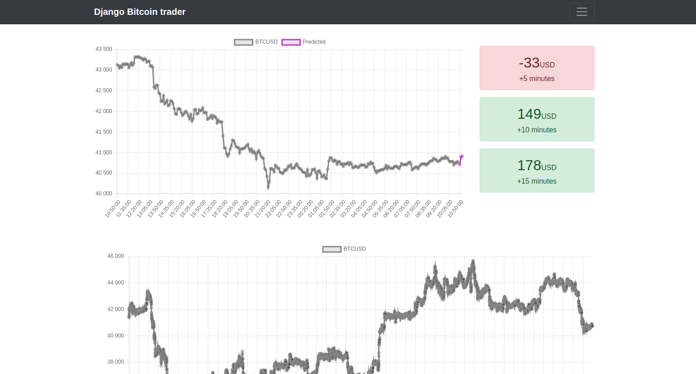

## Django Bitcoin trader

Application created for predicting and visualising future Bitcoin values.



### Used technologies:

- Django
- MySql
- Tensorflow
- Keras
- NumPy
- Bootstrap
- ChartJS


### Install application
```shell
# Create virtual environment and activate it
python3 -m venv venv
source venv/bin/activate

# Install requirements
pip3 install -r requirements.txt

# Migrate database
python manage.py migrate
```

### Sync data
```shell
python manage.py sync_data --from="2021-01-01" --to="2022-02-10"
```

### Learn model
```shell
python manage.py learn
```

### Run web server
```shell
python manage.py runserver
```